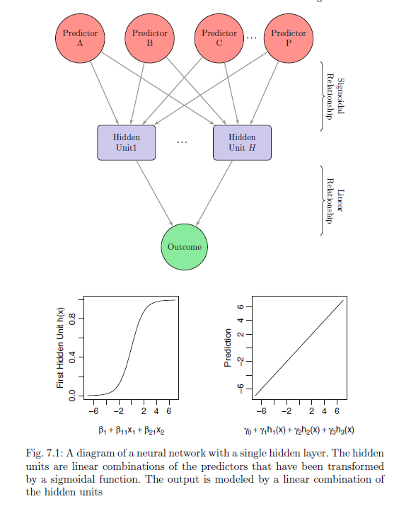

```{r setup, include=FALSE}
knitr::opts_chunk$set(echo = TRUE, message = FALSE, warning = FALSE)
```

```{r results = 'hide'}

suppressPackageStartupMessages( require(oetteR) )
suppressPackageStartupMessages( require(tidyverse) )
suppressPackageStartupMessages( require(caret) )
suppressPackageStartupMessages( require(corrplot) )

```

# Introduction

We will try out several regression models supported by caret and presented in `Applied Predictive Modelling`  

In this POC we will look into two-layer neuronal networks

# Data

The `mlbench` package includes several simulated datasets that can be used as benchmarks. These dataset are described in "01 regression with caret - robust linear modelling"

The `nnet` algorithm which we are going to use takes a long time on my desktop computer in order to converge. To do a propper tuning might take a day or more. Hence we will only use 5-fold cross validation and a limited set of tuning parameters.


```{r}

if( file.exists( 'poc_01_regr_caret.Rdata' ) ){
  
  load( file = 'poc_01_regr_caret.Rdata' )
  
}else{
  
  load( file = file.path('.', 'inst', 'POC_Rmd', 'poc_01_regr_caret.Rdata') )
  
}

set.seed(1)

df = df %>%
  mutate( cv = map(data, rsample::vfold_cv, v = 5 )
          , cv = map(cv, rsample::rsample2caret ) )

```


# `caret`

This wrapper is a bit modified compared to the last wrapper we used.   
- We pass function parameters via the `...` argument.  
- We Specifically turn on parallel processing by `allowParallel = T` and registering 4 CPU cores  
- We return the complete caret model, rather than just parts of it.

## Register CPU cores

- this speeds up performance by 4 x

```{r}

library(parallel)
library(doParallel)
cluster <- makeCluster(detectCores() - 1) ## convention to leave 1 core for OS
registerDoParallel(cluster)

```

## Wrapper

```{r}


wr_car = function( formula, rsample, method, data, grid, ...){
  
  suppressWarnings({
    if( is.na(grid) ) grid = NULL
  })
  
  car = caret::train( formula
                      , data = as.data.frame( data )
                      , method = method
                      , tuneGrid = grid
                      , trControl = caret::trainControl(index = rsample$index
                                                        , indexOut = rsample$indexOut
                                                        , method = 'cv'
                                                        , verboseIter = F
                                                        , savePredictions = T
                                                        , allowParallel = T
                                                        )
                      , ...
                      )
  
  return( car )
  
}
```


# Neuronal Networks

Neuronal networks mimic the organisational pyrimidal structure of cortical neurons in which we have several layers of models working in unison to produce a common outcome. The simplest neuronal netwrok model constist of two layers. One layer that catches none-linear relationships and one layer that builds a linear model on the predictions of the first layer. The models in the first layer connect all or some of the predictors to a hidden unit which collects the predictions of the model. The number of hidden units (equal to the number of models in the first layer) has to be defined by the analyst and is one of the tuning parameters. Then a linear model usies the results of the hidden units to predict the outcome. A dataset with 100 predictors and three hidden units would have in total 100 * 3 + 3 parameter (coefficients + intercept) in the first layer and 3 + 1 parameters for the last layer so in total 307 parameters to minimize the error of the outcome. Such a model is extremely flexible and will most definetely overfit. So similarly to the lasso method a smoothing (penalty term) $\gamma$ is added to the total equation which is the second tuning parameter for such a network. In order to find the optimal parameter values random starting values are chosen and then back propagation ( sequence through first parameter range, find error minimum, then do the same for the second parameter and then the next one, repeat until error does not get any smaller ) is used to find the optimal parameter values. This method will propagate towards a local minima and produces different results in each run. To combat this effect we can average the results of 3-5 models. 

The smoothing term penalizes especially large coefficients, which means that all coefficients need to be on the same scale, meaning that we have to scale and center the predicting variables

The back propagation process is perturbed by high  correlations among the predictor variables therefore we need to filter them out or use principle compenents for fitting the model.

```{r echo = F}


tribble( ~Property, ~Sensitivity
         , 'Colinearity', 'less sensitive, but difficult to interpret variable importance'
         , 'Outlier', 'sensitive'
         , 'Not normally distributed predictors', 'insensitive'
         , 'Not normally distributed response', 'insensitive'
         , 'None-linear correlation between predictors and response', 'sensitive, detects '
         , 'Irrelevant variables', 'insensitive, but increases computation time'
         , 'Unscaled variables', 'insensitive, but necessary for calculation of variable importance'
         ) %>%
  knitr::kable( align = 'lc')


```

**Tuning Parameters:**  
- $\gamma$ range 0.0 - 0.1  
- number of hidden units: 1-20
**Variable Importance:** use `caret` which uses the Gevrey method which uses combinations of the absolute values of the coefficients.


The `nnet` package provides a neuronal network algorithm. `caret` has a version which also does averaging of the produced models `avNNet`.


```{r}

# this would be a sensible tuning grid, but it takes too long to compute
grid = expand.grid( decay = c( 0, 0.01, 0.05, 0.1 )
                    , size = c(1:20) 
                    , bag = c(T,F) )

# overwrite tuning grid with a reduced set of parameters
grid =  expand.grid( decay = c( 0.01, 0.05, 0.1 )
                    , size = c(3, 5, 10, 15 ) 
                    , bag = c(F) )

system.time({
  
  df_nnet = df %>%
    mutate( formula = map( response, paste, '~ .' ) ) %>%
    mutate( method = 'avNNet'
            , formula = map( formula, as.formula )
            , grid = list(grid)
            , car = pmap( list(formula, cv, method, data, grid), wr_car
                            , repeats = 5   ## number of models to average
                            , linout = TRUE ## linear output units
                            , trace = FALSE ## reduce print output
                            , maxit = 500   ## maximum number of iterations
                            ## maximum number of parameters
                            ## no_hidden_units * (ncol(predictors) + 1 ) + no_hidden_units + 1
                            ## adjust, it speeds up fitting
                            , MaxNWts = 182
                            ) 
            ) 

})

```

## Get best tuning parameters, prediction and variable importance

- we will exract the best tuning parameters directly from the caret model instead of picking them out ourselves
- We will use caret::varImp to get variable importance


```{r}

df_nnet_suppl = df_nnet %>%
  mutate( best_tune = map(car, 'bestTune' )
          , preds   = map(car, 'pred' )
          , preds   = map(preds, as.tibble )
          ## if predictions contain NA values column will be converted to character
          ## we have to manually convert it back to numeric
          , preds   = map(preds, mutate, pred = as.numeric(pred) )
          , imp     = map(car, caret::varImp )
          , imp     = map(imp, 'importance' ) 
          )

df_nnet_pred = df_nnet_suppl %>%
  select( - data, - grid, - car, -imp ) %>%
  unnest( best_tune, .drop = F) %>%
  unnest( preds, .drop = F) %>%
  filter( size == size1, decay == decay1, bag == bag1 ) %>%
  select( - size1, -decay1, - bag1)


```

## Plot Tuning

`caret` has a built in plot feature that is compatible with `ggplot2`. It would be nice to have SEM error bars on the plots, but they are not so important for chosing tuning parameters. However if our sampling technique was not too thorough  the best tuning parameters could vary depending on the random splits of the validation method. Here I think error bars would be usefull.

```{r}

df_nnet_plot = df_nnet %>%
  mutate( plot = map( car, ggplot)
          , plot = map2( plot, data_name, function(p,x) p = p + ggtitle(x) ) )


df_nnet_plot$plot

```

- We find that we need around 10 hidden units to properly fit the friedmann benchmark datasets, while we only need 3 for the Hill Data set.  
- We find that the dataset with the added colinear variable had difficulties converging and did not produce any valid results when modelled with 15 hidden units.  
- For the dataset with the added outliers the performance of the tuning parameters are fluctuating a lot. I would expect that this is not very reproducible and very much dependent on that specific 5 fold cv set.


## Distributions of the predictions.

The response variables of the friedmann benchamrk sets 2 and 3 are not normally distributed. For linear regression we would thus expect a skewed residuals plot.

```{r}

df_nnet_pred %>%
  select( data_name, pred, obs ) %>%
  gather( key = 'key', value = 'value', -data_name ) %>%
  ggplot( aes( x = value, fill = key ) ) +
    geom_histogram( position = 'identity'
                    , alpha = 0.5) +
    facet_wrap(~data_name, scales = 'free' )
  

```

We can see that the distributions of the observed values almost perfectly mirror the distributions of the predicted values.

## Residual Plots

```{r}

df_res = df_nnet_pred %>%
  select( data_name, pred, obs ) %>%
  mutate( resid = pred-obs ) %>%
  group_by( data_name ) %>%
  nest() %>%
  mutate( p = pmap( list( df = data, title = data_name),  oetteR::f_plot_pretty_points, col_x = 'obs', col_y = 'resid' )
          , p = map(p, function(p) p = p + geom_hline( yintercept = 0, color = 'black', size = 1) ))

df_res$p

```

However in the residual plots we can see that there is some skewness and we see that we systematicall overestimate observations with small values for the Friedmann 2 dataset and systematically underestimate larger values for the Friedman 3 dataset.

## Variable Importance

```{r}

df_nnet_suppl %>%
  select(data_name, imp) %>%
  mutate( imp = map(imp, function(x) {x$var = row.names(x); x} ) ) %>%
  unnest( imp, .drop = F ) %>%
  group_by( data_name ) %>%
  mutate( rank = rank( desc(Overall) ) ) %>%
  mutate( var = paste(var, round(Overall,1) ) ) %>%
  select( - Overall) %>%
  spread( key = 'data_name', value = 'var' ) %>%
  f_datatable_minimal()

```

## Compare with Correlation Analysis


### Friedman 1   
- V4, V5 correlate with the response in a linear fashion  
- V1, V2 correlate almost linearly but in the higher ranges adopt a none-linear trend  
- V3 has a clear nonelinear correlation that cannot be described or exploited via linear fits  

**all 5 correlating variables contribute to the model, note that V3 correleates in a none-linear fashion**

### Friedman 2   
Response variable beta or gamma distributed with a skewness to the right.  
- V2, V3 correleate with the response in a linear fashion  

**all 2 correlating variables contribute to the model**

### Friedman 3   
Response variable is skewed to the left
- V1 linear correlation to response  
- V2 semi-linear correlation  
- V3 none-linear correlation

**all 3 correlating variables contribute to the model, note that V3 correleates in a none-linear fashion**

### Friedman 1 -colinear

Same as Friedman 1 except for V11 which is the inverse of V4

**V4 and V11 contribute equally**

### Friedman 1 - outlier

Same as Friedman 1

### Hill Racing

**climb does not contribute to the model**

## Performance 

Finally we will calculate the final performance and compare it to regular linear regression

```{r}


df_nnet_perf = df_nnet_pred %>%
  mutate(  se = (pred-obs)^2
           , ae = abs(pred-obs) ) %>%
  group_by( data_name, Resample ) %>%
  summarise( mse = mean(se)
             , mae = mean(ae) ) %>%
  group_by( data_name ) %>%
  summarise( mean_mse = mean(mse)
             , mean_mae = mean(mae)
             , sem_mean_mse = sd(mse) / sqrt( length(mse) )
             , sem_mean_mae = sd(mae) / sqrt( length(mae) )
             , n = length(mae)
             , method = 'avNNet'
             )


final = df_nnet_perf %>%
  bind_rows(final) %>%
  select( data_name, method
          , mean_mse
          , sem_mean_mse
          , mean_mae
          , sem_mean_mae
          , n ) %>%
  arrange( data_name, method) 


final %>%
  f_datatable_universal( round_other_nums = 4, page_length = nrow(.) )

```

## Plot Performance

```{r}

final %>%
  ggplot() +
    geom_pointrange( aes(x = method
                         , y = mean_mae
                         , ymin = mean_mae - sem_mean_mae
                         , ymax = mean_mae + sem_mean_mae
                         , color = method)
                     ) +
  facet_wrap( ~ data_name, scales = 'free_y' )


final %>%
  ggplot() +
    geom_pointrange( aes(x = method
                         , y = mean_mse
                         , ymin = mean_mse - sem_mean_mse
                         , ymax = mean_mse + sem_mean_mse
                         , color = method)
                     ) +
  facet_wrap( ~ data_name, scales = 'free_y' )


```


## Summary

The `avNNet` method significantly outperforms regular linear regression. It is able to model a none-normally-distributed response variable and is able to pick up on none-linear correlations.


```{r save, include = FALSE }

save( final, df, df_lasso, file = 'poc_02_regr_caret.Rdata' )

```
