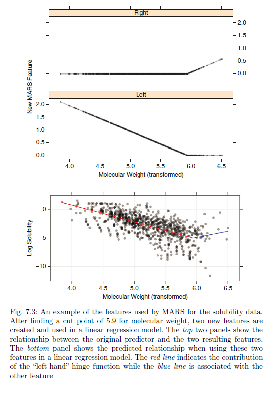

```{r setup, include=FALSE}
knitr::opts_chunk$set(echo = TRUE, message = FALSE, warning = FALSE)
```

```{r results = 'hide'}

suppressPackageStartupMessages( require(oetteR) )
suppressPackageStartupMessages( require(tidyverse) )
suppressPackageStartupMessages( require(caret) )
suppressPackageStartupMessages( require(corrplot) )

```

# Introduction

We will try out several regression models supported by caret and presented in `Applied Predictive Modelling`  

In this POC we will look into multivariate adaptive regression splines (MARS)

# Data

The `mlbench` package includes several simulated datasets that can be used as benchmarks. These dataset are described in "01 regression with caret - robust linear modelling"


```{r}

if( file.exists( 'poc_02_regr_caret.Rdata' ) ){
  
  load( file = 'poc_02_regr_caret.Rdata' )
  
}else{
  
  load( file = file.path('.', 'inst', 'POC_Rmd', 'poc_02_regr_caret.Rdata') )
  
}

set.seed(1)

df = df %>%
  mutate( cv = map(data, rsample::vfold_cv, v = 5 )
          , cv = map(cv, rsample::rsample2caret ) )

```


# `caret`

This wrapper is a bit modified compared to the last wrapper we used.   
- We pass function parameters via the `...` argument.  
- We Specifically turn on parallel processing by `allowParallel = T` and registering 4 CPU cores  
- We return the complete caret model, rather than just parts of it.

## Register CPU cores

- this speeds up performance by 4 x

```{r}

library(parallel)
library(doParallel)
cluster <- makeCluster(detectCores() - 1) ## convention to leave 1 core for OS
registerDoParallel(cluster)

```

## Wrapper

```{r}


wr_car = function( formula, rsample, method, data, grid, ...){
  
  suppressWarnings({
    if( is.na(grid) ) grid = NULL
  })
  
  car = caret::train( formula
                      , data = as.data.frame( data )
                      , method = method
                      , tuneGrid = grid
                      , trControl = caret::trainControl(index = rsample$index
                                                        , indexOut = rsample$indexOut
                                                        , method = 'cv'
                                                        , verboseIter = F
                                                        , savePredictions = T
                                                        , allowParallel = T
                                                        )
                      , ...
                      )
  
  return( car )
  
}
```


# Multivariate Regression Splines (MARS)

MARS is s a relatively ne method invented by the same Friedman that came up with the benchmark datasets that we are using in 1991.

MARS is a none-parametric method with elements of generalized additive models (GAM) or neuronal networks and regression trees. It does not assume a deterministic relationship (linear, logistc, pareto) between the predictors and the response however it uses multiple linear regressions to make its predictions. 

Lets consider a model with a single predictor and a single response. The MARS algorithm will iterate over the range of the predictor and try to find a single hinge point and fit a linear regression to the values of the left side and a seperate linear regression to the left of the hinge point.



Instead of 1 coefficient the MARS model then adds two coefficients to the model each linked to a function that returns zero for values beyond the hinge point. It then contineous to investigate the feature space for more possible hinge points. In our case the freature space is limited to one variable so the model might find additional hinge points for the same variable as can bee seen in the exmplatory figure taken from `Applied statistical modelling`. 

If we continue this iteration we will end up with an extremely overfitted model we therefore have to limit the amount of hinge points in some way. One method would be to control for cross-validated MSE after adding each element to the model and stop adding elements when MSE does not decrease anymore. An alternative approach is the generalised cross validation error (GCV) which is to my understanding an approximation of the cross validation error which factors in a penalty for each term added to the model. According to `Applied statistical modelling` GCV comes close to LOOCV. It seems to me as if it is similar to similar performance values such as AIC and BIC.

I was able to retrieve the following formula from this [post](http://www.statsoft.com/Textbook/Multivariate-Adaptive-Regression-Splines)

$$\frac{\sum(pred-obs)^2}{(1-\frac{1+cd}{N})^2}$$

N = number of observations
c = penalty value in the range of 2-3
d = number of modelling parameters (ceoeffcients)

The MARS algorithm uses the GCV to prune the number of modelling parameters. The maximum number of parameters to be kept in the model is the first tuning parameter usually called `nprune`.

Additionally MARS can add variable interaction terms by multiplying modelling parameters. This is the second tuning parameter which goes by degees of freedom usually abbreviated as `degree`

In general MARS will only add parameters to the model if they improve the model based on the GCV value.

## Example with 1 dimension

The `earth` package provides a popular interface for calculating MARS models.

```{r}

data = df$data[[1]] 

grid = expand.grid( degree = 1, nprune = 40  )

car = caret::train( resp~., data
                    , method = 'earth'
                    , tuneGrid = grid
                    , trControl = caret::trainControl( method = 'cv'
                                          , verboseIter = F
                                          , savePredictions = T
                                          , allowParallel = T
                                          )
                    )

car$finalModel$coefficients %>%
  as.data.frame() %>%
  mutate( parameter = row.names(.)) %>%
  select( parameter, coef = y ) %>%
  knitr::kable( align = c('lc'), digits = 2 )

car$finalModel

```


## Example with 2 dimensions

```{r}

data = df$data[[1]] 

grid = expand.grid( degree = 2, nprune = 40  )

car2d = caret::train( resp~., data
                    , method = 'earth'
                    , tuneGrid = grid
                    , trControl = caret::trainControl( method = 'cv'
                                          , verboseIter = F
                                          , savePredictions = T
                                          , allowParallel = T
                                          )
                    )

car2d$finalModel$coefficients %>%
  as.data.frame() %>%
  mutate( parameter = row.names(.)) %>%
  select( parameter, coef = y ) %>%
  knitr::kable( align = c('lc'), digits = 2 )

car2d$finalModel

```

# Visualizing MARS models

MARS models are easy to understand intuitively and due to their additive nature we can easily visualise their predictive bahaviour by using partial dependency plots. A technique where we generate artificial input data and record the model response. We sequence a variable over its range while keeping all other values at constant mean or median values. When plotting the model response against the variable which we sequenced over we can visualise the impact of that particular variable on the model's predictions. This technique does also work for other model types however for MARS models we visualise the response and the underlying algorithm at the same time. We can use the `plotmo` package which also supports 3d visualisations for model responses when sequencing over the range of two variables at the same time. We can also use functions from `oetteR` which returns ggplot2 plots instead of base R plots.

## `plotmo`

```{r}

imp = varImp( car  ) 
imp = imp$importance %>%
  as.data.frame() %>%
  mutate( variable = row.names(.) ) %>%
  filter( Overall > 0 )

plotmo( car,  all1 = T   ) 

plotmo( car, all1 = F, all2 = T, degree1 = F, degree2 = imp$variable ) 


```

##`oetteR`

this is a bit more code, but we can more easily manipulate the visualisation.

```{r}


data_ls = f_clean_data_no_changes(data)

imp = f_model_importance( car )

formula = resp~V1+V2+V3+V4+V5+V6+V7+V8+V9+V10

palette = f_plot_col_vector74( only_unique = T, greys = F )

color_code = f_plot_color_code_variables( data_ls, palette )


p = oetteR::f_model_plot_variable_dependency_regression( m = car
                                                         , data_ls = data_ls
                                                         , ranked_variables = imp
                                                         , formula = formula
                                                         , variable_color_code = color_code
                                                         )

data_point = data %>%
  gather( key = 'variables', 'value', - resp) %>%
  # variables are ordererd by importance, we have to add the same order
  # with the point layer
  mutate(  variables = fct_relevel( variables, imp$row_names ) )


p = p +
  geom_point( data = data_point
              , mapping = aes( value, resp )
              , alpha = 0.2
              , color = 'lightblue' ) +
  theme_minimal( )


# reverse layers so geom_line comes up on top
p$layers = rev( p$layers )

#switch off legend
p$theme$legend.position = 'none'

p

```

# MARS characteristics

```{r echo = F}

tribble( ~Property, ~Sensitivity
         , 'Colinearity', 'less sensitive, but difficult to interpret variable importance'
         , 'Outlier', 'sensitive'
         , 'Not normally distributed predictors', 'insensitive'
         , 'Not normally distributed response', 'insensitive'
         , 'None-linear correlation between predictors and response', 'sensitive, detects '
         , 'Irrelevant variables', 'insensitive, but increases computation time'
         , 'Unscaled variables', 'insensitive, but necessary for calculation of variable importance'
         ) %>%
  knitr::kable( align = 'lc')

```

**Tuning Parameters:**  
- nprune, range: 1:number of variables * 5
- degree, range: 1:3

Variable importance is a combination of the sum of all scaled coefficient values of all parameters that are linked to one variable.

# MARS tuning


```{r}

# this would be a sensible tuning grid, but it takes too long to compute
grid = expand.grid( degree = c( 1:3 )
                    , nprune = c(1:50) )


system.time({
  
  df_mars = df %>%
    mutate( formula = map( response, paste, '~ .' ) ) %>%
    mutate( method = 'earth'
            , formula = map( formula, as.formula )
            , grid = list(grid)
            , car = pmap( list(formula, cv, method, data, grid), wr_car ) 
            ) 

})

```

## Get best tuning parameters, prediction and variable importance

- we will extract the best tuning parameters directly from the caret model instead of picking them out ourselves
- We will use caret::varImp to get variable importance


```{r}

df_mars_suppl = df_mars %>%
  mutate( best_tune = map(car, 'bestTune' )
          , preds   = map(car, 'pred' )
          , preds   = map(preds, as.tibble )
          ## if predictions contain NA values column will be converted to character
          ## we have to manually convert it back to numeric
          , preds   = map(preds, mutate, pred = as.numeric(pred) )
          , imp     = map(car, caret::varImp )
          , imp     = map(imp, 'importance' ) 
          )

df_mars_pred = df_mars_suppl %>%
  select( - data, - grid, - car, -imp ) %>%
  unnest( best_tune, .drop = F) %>%
  unnest( preds, .drop = F) %>%
  filter( nprune == nprune1, degree == degree1 ) %>%
  select( - nprune1, -degree1 )


```

## Plot Tuning

`caret` has a built in plot feature that is compatible with `ggplot2`. It would be nice to have SEM error bars on the plots, but they are not so important for chosing tuning parameters. However if our sampling technique was not too thorough  the best tuning parameters could vary depending on the random splits of the validation method. Here I think error bars would be usefull.

```{r}

df_mars_plot = df_mars %>%
  mutate( plot = map( car, ggplot)
          , plot = map2( plot, data_name, function(p,x) p = p + ggtitle(x) )
          )


df_mars_plot$plot %>%
  walk( print )


```


We have some overlapping values, it would be great to us plotly to dynamically select the data displayed on the plot however this code fails.

```{r error = T }

p = df_mars_plot$plot[[1]]

plotly::ggplotly(p)

```

In those cases where we cannot see the data for 2 degrees of freedom it has been overplotted by the data of 3 degrees of freedom. Thus we do not get an benefits from having more than two degrees of freedom for most datasets except for the Friedman 3 dataset.

### Best Tuning parameters

```{r}


df_mars_suppl %>%
  unnest( best_tune, .drop = F ) %>%
  select( data_name, nprune, degree) %>%
  knitr::kable( align = 'lcc')

```

# Performance

## Distributions of the predictions.

The response variables of the friedmann benchamrk sets 2 and 3 are not normally distributed. For linear regression we would thus expect a skewed residuals plot.

```{r}

df_mars_pred %>%
  select( data_name, pred, obs ) %>%
  gather( key = 'key', value = 'value', -data_name ) %>%
  ggplot( aes( x = value, fill = key ) ) +
    geom_histogram( position = 'identity'
                    , alpha = 0.5) +
    facet_wrap(~data_name, scales = 'free' )
  

```

We can see that the distributions of the observed values almost perfectly mirror the distributions of the predicted values. It looks similar to the results of the predictions of the neuronal net.

## Residual Plots

```{r}

df_res = df_mars_pred %>%
  select( data_name, pred, obs ) %>%
  mutate( resid = pred-obs ) %>%
  group_by( data_name ) %>%
  nest() %>%
  mutate( p = pmap( list( df = data, title = data_name),  oetteR::f_plot_pretty_points, col_x = 'obs', col_y = 'resid' )
          , p = map(p, function(p) p = p + geom_hline( yintercept = 0, color = 'black', size = 1) ))

df_res$p

```

However in the residual plots we can see that there is some skewness and we see that we systematicall overestimate observations with small values for the Friedmann 2 dataset and systematically underestimate larger values for the Friedman 3 dataset. It looks similar to the results of the predictions of the neuronal net.

## Variable Importance

```{r}

df_mars_suppl %>%
  select(data_name, imp) %>%
  mutate( imp = map(imp, function(x) {x$var = row.names(x); x} ) ) %>%
  unnest( imp, .drop = F ) %>%
  group_by( data_name ) %>%
  mutate( rank = rank( desc(Overall), ties.method = 'first' ) ) %>%
  mutate( var = paste(var, round(Overall,1) ) ) %>%
  select( - Overall) %>%
  spread( key = 'data_name', value = 'var' ) %>%
  knitr::kable( align = 'cccccc')

f_datatable_minimal

```

## Compare with Correlation Analysis


### Friedman 1   
- V4, V5 correlate with the response in a linear fashion  
- V1, V2 correlate almost linearly but in the higher ranges adopt a none-linear trend  
- V3 has a clear nonelinear correlation that cannot be described or exploited via linear fits  

**all 5 correlating variables contribute to the model, note that V3 correleates in a none-linear fashion**

### Friedman 2   
Response variable beta or gamma distributed with a skewness to the right.  
- V2, V3 correleate with the response in a linear fashion  

**all 2 correlating variables contribute to the model**

### Friedman 3   
Response variable is skewed to the left
- V1 linear correlation to response  
- V2 semi-linear correlation  
- V3 none-linear correlation

**all 3 correlating variables contribute to the model, note that V3 correleates in a none-linear fashion**

### Friedman 1 -colinear

Same as Friedman 1 except for V11 which is the inverse of V4

**Only V11 has been selected to contribute, it seems that parameters are selected alphabetically.**

### Friedman 1 - outlier

Same as Friedman 1

### Hill Racing

**climb does not contribute to the model**

## Final Performance 

Finally we will calculate the final performance and compare it to regular linear regression

```{r}


df_mars_perf = df_mars_pred %>%
  mutate(  se = (pred-obs)^2
           , ae = abs(pred-obs) ) %>%
  group_by( data_name, Resample ) %>%
  summarise( mse = mean(se)
             , mae = mean(ae) ) %>%
  group_by( data_name ) %>%
  summarise( mean_mse = mean(mse)
             , mean_mae = mean(mae)
             , sem_mean_mse = sd(mse) / sqrt( length(mse) )
             , sem_mean_mae = sd(mae) / sqrt( length(mae) )
             , n = length(mae)
             , method = 'mars'
             )


final = df_mars_perf %>%
  bind_rows(final) %>%
  select( data_name, method
          , mean_mse
          , sem_mean_mse
          , mean_mae
          , sem_mean_mae
          , n ) %>%
  arrange( data_name, method) 


final %>%
  f_datatable_universal( round_other_nums = 4, page_length = nrow(.) )

```

## Plot Performance

```{r}

p = final %>%
  ggplot() +
    geom_pointrange( aes(x = method
                         , y = mean_mae
                         , ymin = mean_mae - sem_mean_mae
                         , ymax = mean_mae + sem_mean_mae
                         , color = method)
                     ) +
  facet_wrap( ~ data_name, scales = 'free_y' ) +
  theme( legend.position = 'none')

p


p = final %>%
  ggplot() +
    geom_pointrange( aes(x = method
                         , y = mean_mse
                         , ymin = mean_mse - sem_mean_mse
                         , ymax = mean_mse + sem_mean_mse
                         , color = method)
                     ) +
  facet_wrap( ~ data_name, scales = 'free_y' ) +
  theme( legend.position = 'none' )


p

```

### Plot Performace avNNet vs MARS

```{r}

p = final %>%
  filter( method == 'avNNet' | method == 'mars' ) %>%
  ggplot() +
    geom_pointrange( aes(x = method
                         , y = mean_mae
                         , ymin = mean_mae - sem_mean_mae
                         , ymax = mean_mae + sem_mean_mae
                         , color = method)
                     ) +
  facet_wrap( ~ data_name, scales = 'free_y' ) +
  theme( legend.position = 'none')

p


```


# Summary

MARS performs similarly to avNNet but overall slightly better except for the Friedman 3 data set. It also seems to handle outlier better.


```{r save, include = FALSE }

save( final, df, df_lasso, file = 'poc_03_regr_caret.Rdata' )

```

