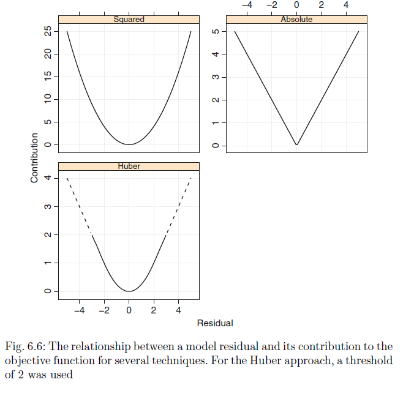

```{r setup, include=FALSE}
knitr::opts_chunk$set(echo = TRUE, message = FALSE, warning = FALSE)
```

```{r results = 'hide'}

suppressPackageStartupMessages( require(oetteR) )
suppressPackageStartupMessages( require(tidyverse) )
suppressPackageStartupMessages( require(caret) )
suppressPackageStartupMessages( require(corrplot) )

```


We will try out several regression models supported by caret and presented in `Applied Predictive Modelling`  

- robust linear regression
- lasso  
- elastic net  
- neuronal networks  
- mars  
- svm  

# Data

The `mlbench` package includes several simulated datasets that can be used as benchmarks

```{r}

set.seed(1)

df = tibble( data = list(mlbench::mlbench.friedman1( 1000 )
                         , mlbench::mlbench.friedman2( 1000 )
                         , mlbench::mlbench.friedman3( 1000 ) 
                        )
  ) %>%
  mutate( x = map(data, 'x')
          , y = map(data, 'y')
          , x = map( x, as_tibble )
          , y = map( y, function(z) tibble(resp = z) )
          , data = map2( y ,x, bind_cols) 
          ) %>%
  mutate( data_name = c('Friedman 1', 'Friedman 2', 'Friedman 3') ) %>%
  select( data_name, data )

```

# Adding outliers

The datasets are designed not to carry any outliers or colinear variables.

We would like to test the outlier sensitivity of the various models and therefore add some outlying observations to the dataset. We will duplicate some of the observations of higher values of the response variable and will downscale two of the best predictor variables of dataset 1.

To increase the impact of the dataset we reduce the total number of samples to 100


```{r}

set.seed(1)

data = df$data[[1]] 

mods = data %>%
  filter( resp > max(resp) * 0.9 ) %>%
  mutate( V4 = V4 * 0.1
          , V5 = V5 * 0.1
          , resp = resp * 1.5 )
  

data_mod = data %>%
  sample_n(100) %>%
  bind_rows(mods)

df = df %>%
  bind_rows( tibble( data = list(data_mod), data_name = 'Friedmann 1 - outlier') )

```


We will also add a classical example for outlier data the hill racing dataset. Where the variables `dist` and `climb` are used to predict `time`.

```{r}

data = MASS::hills %>%
  as_tibble()

df = df %>%
  bind_rows( tibble ( data_name = 'Hill Racing', data = list(data) ) )

```


# Adding Colinearity

For adding colinearity we will add a tenth variable that is inversly correlated to variable 4.

```{r}

data = df$data[[1]] %>%
  mutate( V11 = 1-V4 )

df = df %>%
  bind_rows( tibble( data = list(data), data_name = 'Friedmann 1 - colinear') )

```

Add response variable name to modelling dataframe

```{r}
df = df %>%
  mutate( response = ifelse( startsWith(data_name, 'Fried'), 'resp', 'time') )

```


# X-Y Plots

```{r}

df_plot = df %>%
  mutate( p = map2(data, response,  function(data, resp) gather( data, key = 'key', value = 'value', - resp ) ) 
          , p  = map2(p, response, function(p, resp)  oetteR::f_plot_pretty_points( p, 'value', as.character(resp),'key', scales = 'free_x') )
          , p  = map(p, function(x) x + geom_smooth() + geom_rug() + ggpubr::stat_cor() )
  )

df_plot$p

```


# Histograms

```{r}

df_plot = df %>%
  mutate( hist = map(data, gather, key = 'key', value = 'value')
          , hist = map( hist, f_clean_data_no_changes )
          , hist = map( hist, function(x) f_plot_hist('value', x , add = 'none')  )
          , hist = map( hist, function(x) x = x + facet_wrap(~key, scales = 'free') )
  ) 


df_plot$hist

```

# Correlations

```{r}

df_plot = df_plot %>%
  mutate( cor = map( data , cor)
          , corrplot = map(cor, corrplot, method = 'number') )

```


#  Summary Friedmann Datasets

There is no colinearity between any of the variables. 

## Dataset 1
All variables are normally distributed and scaled.
- V4, V5 correlate with the response in a linear fashion
- V1, V2 correlate almost linearly but in the higher ranges adopt a none-linear trend
- V3 has a clear nonelinear correlation that cannot be described or exploited via linear fits

## Dataset2
Response variable beta or gamma distributed with a skewness to the right.
The variables are not on the same scale.
- V2, V3 correleate with the response in a linear fashion

## Dataset3
Response variable is skewed to the left
The variables are not on the same scale.
- V1 linear correlation to response
- V2 semi-linear correlation
- V3 none-linear correlation


# Transformations

## Scale

```{r}

df = df %>%
  mutate( data = map(data, scale, center = F)
          , data = map(data, as_tibble) )

```


# Feature Selection for linear regression using lasso

```{r}

df_lasso = df %>%
  mutate(  formula = map( data, names )
          , formula = map2( formula, response,  function(x,y) x[ x != y] )
          , formula = map( formula, paste, collapse = '+')
          , formula = map2( formula, response, function(x,y) paste( y , '~', x) )
          , formula = map( formula, as.formula )
          ) %>%
  mutate( lasso = map2( data, formula, f_train_lasso, k = 10, p = NULL)
          , lasso_formula = map_chr(lasso, 'formula_str_lambda_1se') 
          )

select( df_lasso, data_name, lasso_formula )

```

We find that the Lasso perfectly selects the variables that we had confirmed in our previouse analysis as good linear predictors. The lasso also does not mind the colinear variable V11 that we added and does not select it. 
There are however some none-linear qualities for some of the variables and V3 in dataset1 which has not quality as a linear predictor but could be exploited by a model that is able to capture none-linear relationships.

We also find that it selects less variables in the reduced Friedmann 1 dataset with the added outliers. 

# Rsample

We are going to add a `rsample` object to our modelling dataframe. We will chose 10 x 10 cross validation pairs. Each time the data is split into cross validation pairs the results will depend on the specific splits and vary from time to time we repeat it. By doing it 10 times we are much more likely to obtain repeatable results and me can be more certain about the error predictions we are calculating. 

```{r}

df = df %>%
  mutate( cv = map( data, rsample::vfold_cv, v = 10, repeats = 10)
          , cv = map( cv, rsample::rsample2caret) )

```

# Wrapper caret

```{r}

car = function( formula, rsample, method, data, grid){
  
  if( is.na(grid) ) grid = NULL
  
  car = caret::train( formula
                      , data = data
                      , method = method
                      , tuneGrid = grid
                      , trControl = caret::trainControl(index = rsample$index
                                                        , indexOut = rsample$indexOut
                                                        , method = 'cv'
                                                        , verboseIter = F
                                                        , savePredictions = T
                                                        )
                       )
  return( as.tibble(car$pred) )
}
```


# linear regression


```{r}

df_linear = df %>%
  left_join( select( df_lasso, data_name, lasso_formula ) , by = 'data_name') %>%
  rename( formula = lasso_formula ) %>%
  mutate( method = 'glm'
          , formula = map( formula, as.formula )
          , grid = NA
          , preds = pmap( list(formula, cv, method, data, grid), car ) 
          ) 


```

## Example Predictions returned by caret

This is an example of the predictions returned by `caret::train`. We can use `map` and the `dplyr` functions to directly calculate `MSE` inside the modelling dataframe. Note that we have a row index and a Resample index which will theoretically allow us to trace the prediction of a single observation or the mean performance of a certain cross validation sample throughout different models. 

```{r}

preds = df_linear$preds[[1]] %>%
  as_tibble()

preds 

```


```{r}


df_linear_perf = df_linear %>%
  mutate( cv_sample_err = map(preds, mutate
                              , se = (pred-obs)^2 
                              , ae = abs(pred-obs) )
          , cv_sample_err = map(cv_sample_err, group_by, Resample )
          , cv_sample_err = map(cv_sample_err, summarize
                                , mse = mean(se)
                                , mae  = mean(ae)
                                , n = length(se) )
          , means = map(cv_sample_err, ungroup )
          , means = map(means, summarise
                        , mean_mse  = mean(mse)
                        , mean_mae  = mean(mae)
                        , sem_mean_mse = sd(mse) / sqrt( length(mse) )
                        , sem_mean_mae = sd(mae) / sqrt( length(mae) )
                        , n = length(mae) ) ) %>%
  unnest(means)


```

## Example Modelling dataframe with predictions and performance

inside the modelling dataframe we keep the `preds` columns containing all the predictions. We have the `cv_sample_mse` where we keep the summarized `MSE` for each of the 10 x 10 cross validation samples. These will allow us to calculate error bars for the total `mean_mse` value.

```{r}

df_linear

```

## Performance Summary

```{r}

select( df_linear_perf, data_name
        , mean_mse
        , sem_mean_mse
        , mean_mae
        , sem_mean_mae
        , n
        ) %>%
  knitr::kable( align = 'lc')

```

as expected the linear regression performs worse for the dataset for which we had added the outliers

# robust linear regression

Regular regression models seek to minimize SSE (squared standard error). This overpenalizes large errors over small errors which makes linear regression quite sensitive to outliers. The huber method counts smaller errors as squared errors and larger errors as absolute errors making regressions more robust. 


```{r echo = F}

tribble( ~Property, ~Sensitivity
         , 'Colinearity', 'sensitive'
         , 'Outlier', 'less sensitive'
         , 'Nonlinearity', 'sensitice'
         , 'Irrelevant variables', 'sensitive'
         , 'Unscaled variables', 'unsensitive'
         ) %>%
  knitr::kable( align = 'lc')

```

**Tuning Parameter:** Huber Threshold (1.345 almost always best option ?)
**Variable Importance:** scaled absolute coefficent values  


The `MASS` package offers a `MASS::rlm` which supports also a few other improved loss funtions in addition to the huber method. If we pass `grid = NULL` to `caret` it will automatically try them all. They are described in this (presentation)[https://web.as.uky.edu/statistics/users/pbreheny/764-F11/notes/12-1.pdf] .However I am not sure if here we will really tune the individual huber threshold. It seems that Huber offered 1.345 as an almost optimal threshold value. It seems to me that `caret` keeps it at that value and only tunes for the type of loss function.

```{r}


df_rlm = df %>%
  left_join( select( df_lasso, data_name, lasso_formula ) , by = 'data_name') %>%
  rename( formula = lasso_formula ) %>%
  mutate( method = 'rlm'
          , formula = map( formula, as.formula )
          , grid = NA
          , preds = pmap( list(formula, cv, method, data, grid), car ) 
          ) 


```

## Example predictions with tuning parameters

```{r}
df_rlm$preds[[1]]
```

## Find best set of tuning parameter

We will select the best tuning parameter in respect to absolute error (AE). AE does not overtly penalize large errors over small errors as does MSE. We reckon that this is a more adequate measure to check whether the `rlm` method lead to any improvement in the modelling of the outlier ridden datasets.

We first select the best tuning parameters ignoring the different cv sets

```{r}

df_tune = df_rlm %>%
  mutate( tune_err = map(preds, mutate
                         , se = (pred-obs)^2 
                         , ae = abs(pred - obs) )
          , tune_err = map(tune_err, group_by, intercept, psi )
          , tune_err = map(tune_err, summarize
                           , mse = mean(se)
                           , mae = mean(ae) )
  ) %>%
  unnest(tune_err) %>%
  group_by(data_name) %>%
  mutate( rank = rank(mae) ) %>%
  filter( rank == 1 ) %>%
  select( data_name, intercept, psi ) %>%
  mutate( psi = as.character(psi) )

df_tune %>%
  knitr::kable()

```

## Performance 

Then we filter for the best tuning parameters and group by cross validation set. 

```{r}


df_rlm_perf = df_rlm %>%
  left_join( df_tune ) %>%
  mutate( cv_sample_err = map(preds, mutate
                              , se = (pred-obs)^2
                              , ae = abs(pred-obs) )
          # filter best tuning parameters
          , cv_sample_err = pmap( list(cv_sample_err, intercept, psi) 
                                  , function(x,y,z) filter( x , intercept == y, psi == z ) )
          , cv_sample_err = map(cv_sample_err, group_by, Resample )
          , cv_sample_err = map(cv_sample_err, summarize
                                , mse = mean(se)
                                , mae = mean(ae) )
          , mean_err = map(cv_sample_err, ungroup )
          , mean_err = map(mean_err, summarise
                           , mean_mse = mean(mse)
                           , mean_mae = mean(mae)
                           , sem_mean_mse = sd(mse) / sqrt( length(mse) )
                           , sem_mean_mae = sd(mae) / sqrt( length(mae) )
                           , n = length(mae)
                           ) ) %>%
  unnest(mean_err)


df_rlm_perf %>%
  bind_rows(df_linear_perf) %>%
  select( data_name, method
          , mean_mse
          , sem_mean_mse
          , mean_mae
          , sem_mean_mae
          , n ) %>%
  arrange( data_name, method) %>%
  knitr::kable( align = 'lcc')

```

We are getting a minimal improvement in the datasets with the outliers using `rlm`. If we apply the rule of thump that a model is prefereable to another only if its mean error + SEM is smaller than the mean error of the other model, we find that the `rlm` method gives us a valid improvement over `glm` only when considering the MAE for the `Hill Racing` dataset. 0.102 + 0.009 < 0.123. 

## rlm without caret

I would like to check whether the findings above hold up when tuning the huber threshold manually. We do not have that option in caret, so we do it manually

```{r}

wr_rlm = function( formula, split, huber ){
  
  train = as.data.frame(split, data = 'analysis')
  test = as.data.frame(split, data = 'assessment')
  
  m = MASS::rlm( formula, train , psi = MASS::psi.huber, k = huber )
  
  preds = predict(m, newdata = test)
  
  resp = f_manip_get_response_variable_from_formula(formula)
  
  obs = test[[resp]]
  
  return( tibble(obs = obs, preds = preds) )
}

x = 1:15

grid = expand.grid( list( huber = 0.01 * 2^x) )

df_wr_rlm = df %>%
  left_join( select(df_lasso, data_name, lasso_formula ) ) %>%
  mutate( cv = map(data, rsample::vfold_cv, v = 10, repeats = 10)
          , huber = grid
          , formula = map(lasso_formula, as.formula ) ) %>%
  unnest( huber , .drop = FALSE) %>%
  select( - data ) %>%
  unnest( cv , .drop = FALSE) %>%
  mutate( preds = pmap( list(formula, splits, huber)
                        , wr_rlm) )

#  calculate errors
df_wr_lm_perf = df_wr_rlm %>%
  mutate( preds = map(preds, mutate
                      , se = (preds-obs)^2
                      , ae = abs(preds-obs) )
          , preds = map(preds, summarise
                        , mse = mean(se)
                        , mae = mean(ae) ) ) %>%
  unnest( preds, .drop = FALSE )
  
# select best huber parameter by MAE
df_wr_lm_tune = df_wr_lm_perf %>%
  group_by( data_name, huber ) %>%
  summarise( mean_mse       = mean(mse)
             , sem_mean_mse = sd(mse) / sqrt( length(mse) )
             , mean_mae     = mean(mae)
             , sem_mean_mae = sd(mae) / sqrt( length(mae) )
             , n = length(mae)
             ) %>%
  group_by( data_name ) %>%
  mutate( rank = rank(mean_mae, ties.method = 'first') ) %>%
  filter( rank == 1)

df_wr_lm_tune %>%
  select( data_name, huber) %>%
  knitr::kable( align = 'lc')

```

We can see that 1.345 does not always come up as the best threshold value.

Filter by best tuning parameters

```{r}

df_wr_lm_perf_filt = df_wr_lm_tune %>%
  select( data_name, huber) %>%
  left_join( df_wr_lm_perf ) %>%
  group_by( data_name ) %>%
  summarise( mean_mse       = mean(mse)
             , sem_mean_mse = sd(mse) / sqrt( length(mse) )
             , mean_mae     = mean(mae)
             , sem_mean_mae = sd(mae) / sqrt( length(mae) )
             , n = length(mae)
             ) 


final = df_wr_lm_perf_filt %>%
  mutate( method = 'wr_rlm') %>%
  bind_rows( df_rlm_perf ) %>%
  bind_rows(df_linear_perf ) %>%
  select( data_name, method, mean_mse, sem_mean_mse, mean_mae, sem_mean_mae, n  )%>%
  arrange( data_name, method )


f_datatable_minimal(final)

```


Even with manually tuning the huber threshold we could not increase the modelling performance for the dataset with the artificial outliers that we added.

## Plot Performance of datasets with outliers

```{r}

final %>%
  filter( data_name == 'Hill Racing' | data_name == 'Friedmann 1 - outlier' ) %>%
  ggplot() +
    geom_pointrange( aes(x = method
                         , y = mean_mae
                         , ymin = mean_mae - sem_mean_mae
                         , ymax = mean_mae + sem_mean_mae
                         , color = method)
                     ) +
  facet_wrap( ~ data_name, scales = 'free_y' )


final %>%
  filter( data_name == 'Hill Racing' | data_name == 'Friedmann 1 - outlier' ) %>%
  ggplot() +
    geom_pointrange( aes(x = method
                         , y = mean_mse
                         , ymin = mean_mse - sem_mean_mse
                         , ymax = mean_mse + sem_mean_mse
                         , color = method)
                     ) +
  facet_wrap( ~ data_name, scales = 'free_y' )


```

## Summary

The `rlm` method does not really hold up in a scenario with through cross validation when the outliers that 
